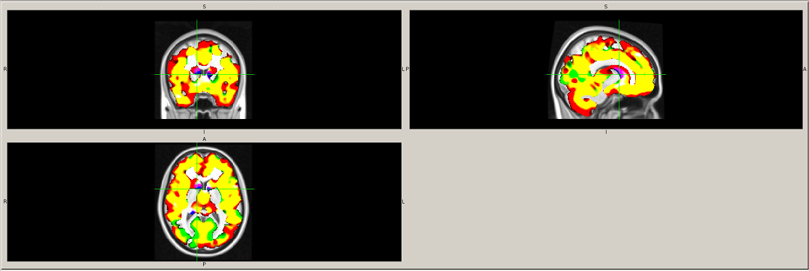
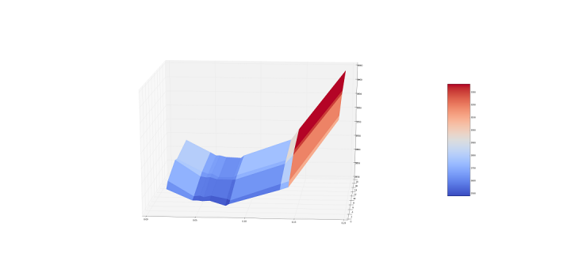

# Non-linear analysis toolbox for neuroimaging

This software provides the tools to analyze linear and potentially non-linear
dynamics of grey-matter and study the statistical significance of such dynamics.

## What does this software offer?

#### Fitters
Several **fitting** methods, each with its pros and cons, that
give you the option to choose the ones that fit the most for your
particular study:

- General Linear Model (GLM)
- General Linear Model with polynomial feature expansion (PolyGLM)
- Generalized Additive Models (GAM)
    - Polynomial smoother
    - Splines smoother
- Support Vector Regression with linear kernel and polynomial feature expansion (PolySVR)
- Support Vector Regression with Gaussian kernel (GaussianSVR)

#### Fit evaluation metrics
It includes several metrics to
evaluate the fitting results, such as:

- Mean Squared Error (mse)

    
    
- R squared (r2)

    
    
- Penalized Residual Sum of Squares (prss)

    
    
- Variance normalized - Penalized Residual Sum of Squares (vnprss)
    
    
    
- F statistic (fstat)

    
    
- F test (ftest)

    
    
- Akaike Information Criterion (aic)

    

#### Methods to compare between statistical maps
You can also compare between statistical maps with up to four different techniques:

- RGB: each map is put as RGB channel, so you can compare between 2 and 3 maps by looking at the colour of the 
resulting map at each region

- Best model: for each voxel the highest value is picked, and that produces a map with the highest values for all 
compared statistical maps, and also a map with the labels of the maps that had the highest value at a particular voxel

- Absolute difference: absolute difference between 2 statistical maps

- SE: squared error between 2 statistical maps

#### Curve visualization

This software allows you to visualize the fitted curves, with the option to overlap several of them so that you can 
visually compare them.

#### Graphical curve visualization

On top of the previously mentioned curve visualization tool this software offers an FSLView-like tool: with this 
visualization tool you can load any statistical map and several of the fitting results you may have previously 
computed, and it shows you the curves for the selected voxel, allowing you to navigate through the statistical map
and see the curves for each voxel. 

#### Hyperparameters finder

Some of the fitters depend on hyperparameters, in particular the Support Vector Regression fitters depend on the 
epsilon, the C and, in the case of GaussianSVR, the gamma. In order to find optimal hyperparameters to fit the data
of your study, this software incorporates a **GridSearch** based approach. 

The error function that the GridSearch algorithm tries to minimize can be picked among these:

- MSE

- Cp statistic

- ANOVA-based error

#### Data and residuals distribution plots

Another useful feature included in this software is the ability to plot univariate or bivariate distributions of the 
data or the residuals, as well as box plots, both for all subjects or to compare between categories.

 

___

## Requirements

TODO

## How can I install it?

TODO

## Usage instructions

The interaction between the user and the software currently uses a Command Line Interface (CLI). 
The scripts that implement each feature of the toolbox are going to be described with detail in this section:

##### compute_fitting.py

##### generate_user_parameters.py

##### compute_statistical_maps.py

##### compare_statistical_maps.py

##### search_hyperparameters.py

##### show_curves.py

##### show_visualizer.py

##### show_data_distribution.py
